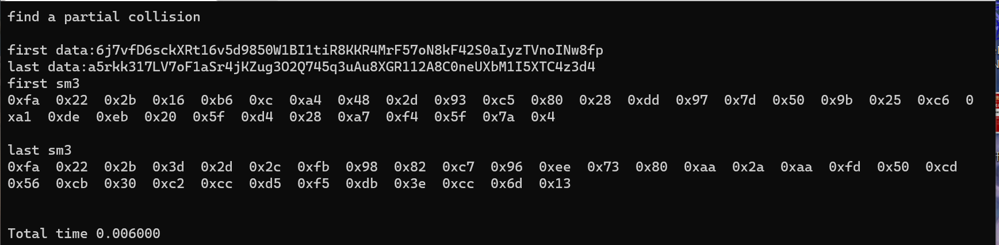
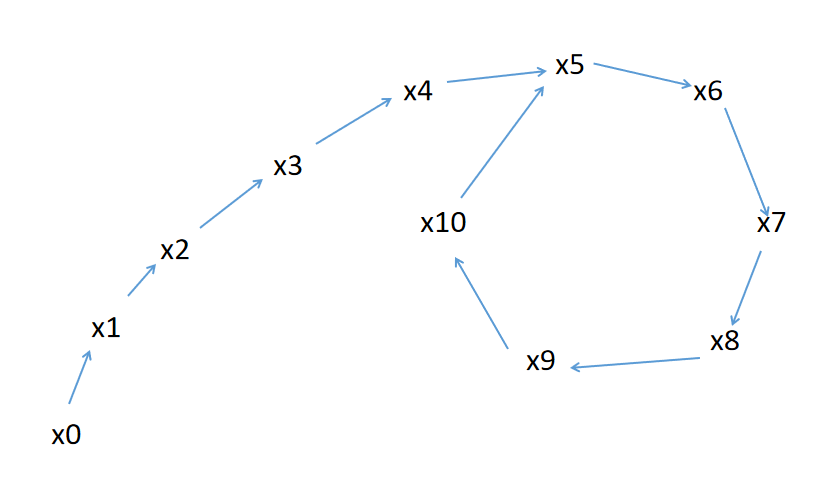
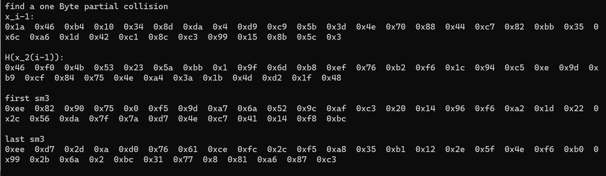
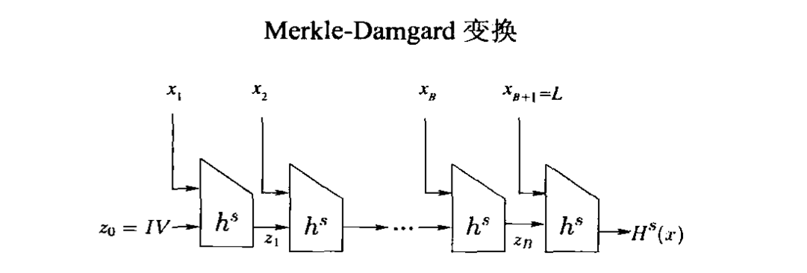
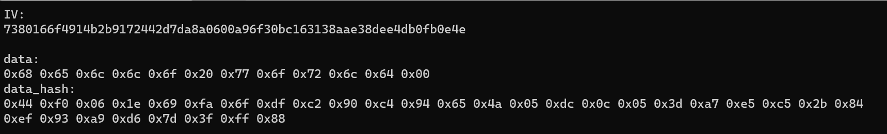
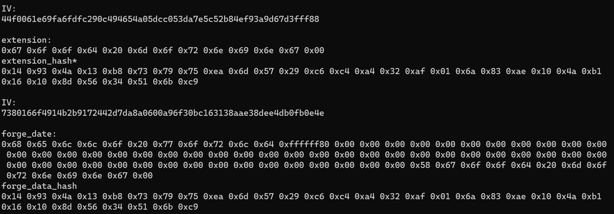

# 2022summer

* [2022summer](#2022summer)
  * [1\. 生日攻击](#1-生日攻击)
    * [1\.1 实验目的](#11-实验目的)
    * [1\.2 实验原理：生日悖论](#12-实验原理生日悖论)
    * [1\.3 实验过程](#13-实验过程)
      * [1\.3\.1 代码说明](#131-代码说明)
      * [1\.3\.1 运行指导](#131-运行指导)
    * [1\.4 实验改进](#14-实验改进)
      * [1\.4\.1 改进的生日攻击](#141-改进的生日攻击)
      * [1\.4\.2 代码说明](#142-代码说明)
      * [1\.4\.2 运行指导](#142-运行指导)
    * [1\.5 实验问题](#15-实验问题)
  * [2\. 长度扩展攻击](#2-长度扩展攻击)
    * [2\.1 实验目的](#21-实验目的)
    * [2\.2 攻击原理](#22-攻击原理)
      * [2\.2\.2 Merkle\-Damgard变换构造方法](#222-merkle-damgard变换构造方法)
      * [2\.2\.3 长度扩展攻击](#223-长度扩展攻击)
    * [2\.3 实验过程](#23-实验过程)
      * [2\.3\.1 代码说明](#231-代码说明)
      * [2\.3\.2 运行指导](#232-运行指导)

## 1. 生日攻击

### 1.1 实验目的

实现对国密算法sm3的生日攻击

### 1.2 实验原理：生日悖论

如果一个班级中的人数大于等于`23`，可以计算出有两个人生日相同的概率要大于`50%`。应用于密码学散列函数中可以得到结论：对于`n`位长的哈希表，概率上仅需要$2^\frac{n}{2}$次检测就可以找到一对碰撞，而非$2^n$次。

本实验通过随机生成字符串作为`SM3`的消息输入，实现消息散列值的部分碰撞。

### 1.3 实验过程

#### 1.3.1 代码说明

首先借鉴一个随机生成指定长度字符串的函数`genRandomString()`，实现代码如下：

```c++
char* genRandomString(int length)
{
	int flag, i;
	char* string;
	if ((string = (char*)malloc(length)) == NULL)
	{
		printf("Malloc failed!\n");
		return NULL;
	}

	for (i = 0; i < length - 1; i++)
	{
		flag = rand() % 3;
		switch (flag)
		{
		case 0:
			string[i] = 'A' + rand() % 26;
			break;
		case 1:
			string[i] = 'a' + rand() % 26;
			break;
		case 2:
			string[i] = '0' + rand() % 10;
			break;
		default:
			string[i] = 'x';
			break;
		}
	}
	string[length - 1] = '\0';
	return string;
}
```

然后调用`OPENSSL`的`EVP`框架里的`SM3`加密，封装的`sm3_hash()`如下：

```c++
int sm3_hash(char* message, size_t len, unsigned char* hash, unsigned int* hash_len)
{
    EVP_MD_CTX* md_ctx;
    const EVP_MD* md;

    md = EVP_sm3();
    md_ctx = EVP_MD_CTX_new();
    EVP_DigestInit_ex(md_ctx, md, NULL);
    EVP_DigestUpdate(md_ctx, message, len);
    EVP_DigestFinal_ex(md_ctx, hash, hash_len);
    EVP_MD_CTX_free(md_ctx);
    return 0;
}
```

在`demo`中，设置碰撞位置为前三个字节。调用`genRandomString()`函数随机生成两个字符串`buff1,buff2`，调用`sm3_hash()`分别计算`buff1`和`buff2`的散列值`hash_value1,hash_value2`，如果碰撞位置的散列值相同则输出结果，否则重复上述过程直至找到部分碰撞。该过程代码如下：

```c++
while (true) {
		buff1 = genRandomString(64);
		buff2 = genRandomString(64);
		unsigned int buff1_len = strlen((char*)buff1);
		unsigned int buff2_len = strlen((char*)buff2);
		unsigned char hash_value1[64];
		unsigned char hash_value2[64];
		unsigned int i, hash_len;

		sm3_hash(buff1, buff1_len, hash_value1, &hash_len);
		sm3_hash(buff2, buff2_len, hash_value2, &hash_len);
		int counter = 0;
		for (int i = 0;i < coll_num;i++) {
			if (hash_value1[i] == hash_value2[i]) {
				counter++;
			}
		}
```

#### 1.3.1 运行指导

可以修改`coll_num`的值决定碰撞位数，默认从散列值的第一位开始计数，也可以修改为碰撞散列值中离散的位置。

直接运行代码即可。

下图为碰撞散列值前三个字节的实验结果：



### 1.4 实验改进

#### 1.4.1 改进的生日攻击

上述的生日攻击需要攻击者存储所有的散列值，因为攻击者不知道事先哪一对输入会造成碰撞，存储下之前所有问询过的散列值，可以减少计算散列值的次数，但是相应的将增加检查是否碰撞的次数（本实验中实验设备有限，故没有存储所有的散列值）。但是相对于时间来说，空间通常是更稀缺的资源，所以有必要将生日攻击的空间需求降低，即采用一个固定数量的存储。具体方法如下：

采取一个随机的初始值$x_0$，对于$i>0$，计算出$x_i:=H(x_{i-1})$和$x_{2i}:=H(H(x_{2(i-1)}))$，在每一步中，比较$x_i$和$x_{2i}$，如果相同，则找到一对碰撞。如果$H$被定义为随机函数，则发生碰撞的概率和简单的生日攻击相同，而`SM3`的加密过程可以视为伪随机函数，因此也可以在$n$位长的哈希表中，概率上以需要$2^\frac{n}{2}$次检测找到一对碰撞。

#### 1.4.2 代码说明

`genRandomString()`和`sm3_hash()`函数定义与简单的生日攻击相同。

随机生成一个`32`字节的字符串`buff1`作为$x_0$，对于$i>0$，用`tmp1`表示$x_{i-1}$，用`tmp2`表示$x_{2(i-1)}$，用`tmp2`表示$H(x_{2(i-1)})$。

调用`sm3_hash()`函数计算`tmp1`的散列值`hash_value1`，计算`tmp2`的散列值`hash_value2`也就是`tmp_2`，计算`tmp_2`的散列值`hash_value2`。

比较`hash_value1`和`hash_value2`的部分位置是否相同，如果设定的碰撞位置上的字符相同，则输出结果并停止循环，不相同则将`hash_value1`的值代入`tmp1`，将`hash_value2`的值代入`tmp2`中，循环进行上述计算。实现代码如下：

```c++
while (true) {

		unsigned int tmp1_len = 32;
		sm3_hash1(tmp1, tmp1_len, hash_value1, &hash_len);//x1,x2,x3...

		unsigned int tmp2_len = 32;
		sm3_hash1(tmp2, tmp2_len, hash_value2, &hash_len);
		sm3_hash1(hash_value2, hash_len, hash_value2_, &hash_len);//x2,x4,x6...
		
		memcpy((void*)tmp2, hash_value2_, 33);//x2,x4,x6...
		memcpy((void*)tmp1, hash_value1, 33);//x1,x2,x3...
```

举例说明，例如第一轮用$x_0$加密得到$x_1$和$x_2$，如果$x_1$和$x_2$没有发生期待的碰撞，则将$x_1$和$x_2$作为下一轮计算的初始值，在第二轮中得到$x_2:=H(x_{1})$和$x_4:=H(H(x_2))$。如果$x_2$和$x_4$没有发生期待的碰撞，则将$x_2$和$x_4$作为下一轮计算的初始值，在第二轮中得到$x_3:=H(x_{2})$和$x_6:=H(H(x_4))$，比较$x_3$和$x_6$是否发生期待碰撞。以此类推，直到发生期待的碰撞为止，计算过程形似$\rho$。



#### 1.4.2 运行指导

可以修改`coll\_num`的值决定碰撞位数，默认从散列值的第一位开始计数，也可以修改为碰撞散列值中离散的位置。

直接运行代码即可。

下图为碰撞散列值前一个字节的实验结果：



### 1.5 实验问题

本实验中改进后的生日攻击比简单的生日攻击速度慢了许多，原因是在计算$x_{2i}:=H(H(x_{2(i-1)}))$的时候进行了两次`SM3`的计算，但是其中的$H(x_{2(i-1)})$已经在之前某一轮的$x_j$中计算过，证明如下，若存在$H(x_{2(i-1)})=H(x_{j-1})$，可以计算出$j=2i-1$，其中$i,j>0$，所以有$i\le j$，得证。因此可以发现问题$\rho$的“尾巴”上的值都被重复计算了一次，浪费了大量的时间，因此本实验的改进的生日攻击速度远不如相同碰撞位数的简单的生日攻击。实验的下一步将对此进行改进。

## 2. 长度扩展攻击

### 2.1 实验目的

实现对国密算法SM3的长度扩展攻击

### 2.2 攻击原理

诸如SM3、MD5、SHA256等算法使用Merkle-Damgard变换以处理任意长度的消息输入，同时保留了散列函数的抗碰撞性，但是这种结构提供了长度扩展攻击的可能性。

#### 2.2.2 `Merkle-Damgard`变换构造方法

令(Gen,h)是一个定长抗碰撞散列函数，其输入量长度为2l(n)，输出量长度为l(n)，构造变长散列函数(Gen,H)如下

Gen:保持不变

H:输入密钥s和消息串x，且x的长度L可以用l位表示。用0将x填充至l的倍数，将填充后的x按长度为l进行分块，记分块数为B，记分块为x1,x2…xB，令xB+1=L。z0记为初始向量IV，按如图方式计算，输出最后一轮的H(x)。



对于SM3算法，消息填充是在消息m后先填1，再填充最少的0至消息长度模512余448，最后64位填充消息长度，对于填充了长度后的消息再进行分块，而非消息长度占据一个分块。初始向量IV=0x7380166f, 0x4914b2b9, 0x172442d7, 0xda8a0600, 0xa96f30bc, 0x163138aa, 0xe38dee4d, 0xb0fb0e4e。

#### 2.2.3 长度扩展攻击

如果敌手获得了消息x和他的散列值H(x)，则敌手可以自己构造一个y值，将y和H(x)作为h的输入，得到H‘(x)，则H’(x)是x1||x2||…||L||y的合法输出。令y满足被攻击的算法的消息填充规则，例如攻击SM3算法，令y=y’||1||0…0||L’，其中，L‘=512*(B+1)+|y’|。敌手问询预言机(x,IV)的散列值H(x)和(y,H(x))的散列值H’(x)，可以伪造消息m’=x||1||0…0||L||y’的合法SM3摘要H‘(x)。

### 2.3 实验过程

#### 2.3.1 代码说明

`main()`之前代码的为SM3的实现，封装成函数`simSm3()`。

剩余部分为对指定消息hello world的长度扩展攻击。

其中`data`为初始消息hello world的十六进制，`extension`为扩展消息good morning的十六进制，长度12字节。因为`data`长度为11字节，即0x58，所以伪造消息`forge_data`如下：

```c++
const char data[] = { 0x68,0x65,0x6c,0x6c,0x6f,0x20,0x77,0x6f,0x72,0x6c,0x64,0x00 };//hello world

    const char extension[] = "good morning";//0x67 0x6f 0x6f 0x64 0x20 0x6d 0x6f 0x72 0x6e 0x69 0x6e 0x67 0x00

    const char forge_data[] = { 0x68,0x65,0x6c,0x6c,0x6f,0x20,0x77,0x6f,0x72,0x6c,0x64,0x80,
        0x00,0x00,0x00,0x00,0x00,0x00,0x00,0x00,0x00,0x00,0x00,0x00,0x00,0x00,0x00,0x00,0x00,0x00,
        0x00,0x00,0x00,0x00,0x00,0x00,0x00,0x00,0x00,0x00,0x00,0x00,0x00,0x00,0x00,0x00,0x00,0x00,
        0x00,0x00,0x00,0x00,0x00,0x00,0x00,0x00,0x00,0x00,0x00,0x00,0x00,0x00,0x00,0x58,
        0x67,0x6f,0x6f,0x64,0x20,0x6d,0x6f,0x72,0x6e,0x69,0x6e,0x67,0x00 };

```

其中`forge_data`长度为64+12=76字节，0x80是表示消息结束的填充字符。

为了实现对`simSm3()`的长度扩展攻击，需要准备一个攻击函数`simSm3LE()`：攻击函数与`simSm3()`类似，但是初始向量IVLE与SM3的初始向量IV不同，消息填充时填充的长度也不同，实现代码如下：

```c++
void simSm3LE(uint8_t* dgst, const char* src, size_t str_length)
{
    Sm3Ctx ctx;
    sm3InitLE(&ctx);
    sm3Update(&ctx, src, str_length);
    sm3FinalLE(&ctx, dgst);
}
```

其中`sm3InitLE()`是将初始向量IV替换为`IVLE[] = { 0x44F0061E, 0x69FA6FDF, 0xC290C494, 0x654A05DC ,0x0C053DA7 ,0xE5C52B84 ,0xEF93A9D6 ,0x7D3FFF88 }`的`sm3Init()`，其中`IVLE=SM3(data)`

其中`sm3FinalLE()`是修改了填充长度的`sm3FinalLE()`，`count[0]`记录了传入数据的长度，因此在此之上在增加`data`的填充后的长度。实现代码如下：

```c++
static void sm3FinalLE(Sm3Ctx* ctx, uint8_t* v, uint64_t data_len)
{
    size_t i;
    uint32_t* t_v = (uint32_t*)(v);
    uint64_t* count = (uint64_t*)(ctx->msg + SM3_MSG_BLOCK_BYTESIZE - 8);
    ctx->msg[ctx->num] = 0x80;
    if (ctx->num + 9 <= SM3_MSG_BLOCK_BYTESIZE) {
        memset(ctx->msg + ctx->num + 1, 0, SM3_MSG_BLOCK_BYTESIZE - ctx->num - 9);
    }
    else {
        memset(ctx->msg + ctx->num + 1, 0, SM3_MSG_BLOCK_BYTESIZE - ctx->num - 1);
        CF(ctx->v, ctx->msg);
        memset(ctx->msg, 0, SM3_MSG_BLOCK_BYTESIZE - 8);
    }

    count[0] = (uint64_t)(ctx->nblocks) * 512 + (ctx->num << 3);
    count[0] += 512*data_len;
    count[0] = byteSwap_64(count[0]);
    CF(ctx->v, ctx->msg);
    for (i = 0; i < sizeof(ctx->v) / sizeof(ctx->v[0]); i++) {
        t_v[i] = byteSwap_32(ctx->v[i]);
    }

}
```

#### 2.3.2 运行指导

首先先在`data`中存放初始消息，`forge_data和extension`暂时不使用，可使用默认值。运行一次程序，结果如图：



然后将`data_hash`下的值替换代码中的`IVLE`，之后按照敌手需求填写`extension`，构造`fore_data=data||0x80||0x00...0x00||extension`，其中`forge_data`用十六进制填写。再次运行程序，结果如图：



观察`extension_hash*`与`forge_data_hash`是否相等，相同的攻击成功。