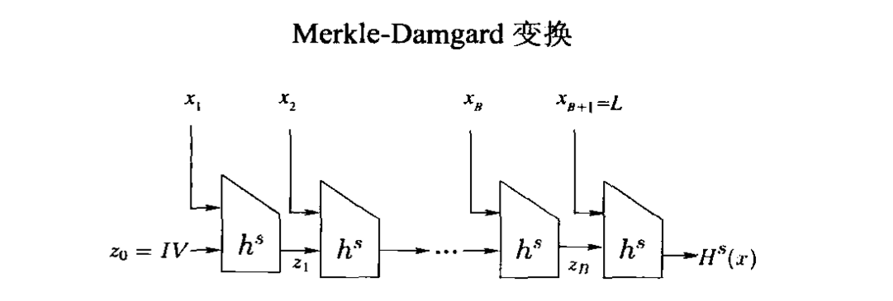
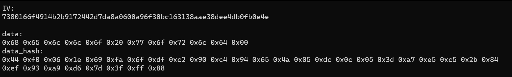
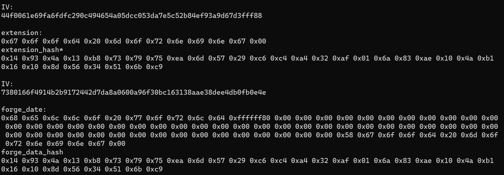

 * [实验目的](#实验目的)
  * [攻击原理](#攻击原理)
    * [$Merkle-Damgard$变换构造方法](#merkle-damgard变换构造方法)
    * [长度扩展攻击](#长度扩展攻击)
* [实验过程](#实验过程)
  * [代码说明](#代码说明)
  * [运行指导](#运行指导)

##### 实验目的

实现对国密算法SM3的长度扩展攻击

##### 攻击原理

诸如SM3、MD5、SHA256等算法使用Merkle-Damgard变换以处理任意长度的消息输入，同时保留了散列函数的抗碰撞性，但是这种结构提供了长度扩展攻击的可能性。

###### $Merkle-Damgard$变换构造方法

令(Gen,h)是一个定长抗碰撞散列函数，其输入量长度为2l(n)，输出量长度为l(n)，构造变长散列函数(Gen,H)如下

Gen:保持不变

H:输入密钥s和消息串x，且x的长度L可以用l位表示。用0将x填充至l的倍数，将填充后的x按长度为l进行分块，记分块数为B，记分块为x1,x2…xB，令xB+1=L。z0记为初始向量IV，按如图方式计算，输出最后一轮的H(x)。



对于SM3算法，消息填充是在消息m后先填1，再填充最少的0至消息长度模512余448，最后64位填充消息长度，对于填充了长度后的消息再进行分块，而非消息长度占据一个分块。初始向量IV=0x7380166f, 0x4914b2b9, 0x172442d7, 0xda8a0600, 0xa96f30bc, 0x163138aa, 0xe38dee4d, 0xb0fb0e4e。

###### 长度扩展攻击

如果敌手获得了消息x和他的散列值H(x)，则敌手可以自己构造一个y值，将y和H(x)作为h的输入，得到H‘(x)，则H’(x)是x1||x2||…||L||y的合法输出。令y满足被攻击的算法的消息填充规则，例如攻击SM3算法，令y=y’||1||0…0||L’，其中，L‘=512*(B+1)+|y’|。敌手问询预言机(x,IV)的散列值H(x)和(y,H(x))的散列值H’(x)，可以伪造消息m’=x||1||0…0||L||y’的合法SM3摘要H‘(x)。

#### 实验过程

##### 代码说明

`main()`之前代码的为SM3的实现，封装成函数`simSm3()`。

剩余部分为对指定消息hello world的长度扩展攻击。

其中`data`为初始消息hello world的十六进制，`extension`为扩展消息good morning的十六进制，长度12字节。因为`data`长度为11字节，即0x58，所以伪造消息`forge_data`如下：

```c++
const char data[] = { 0x68,0x65,0x6c,0x6c,0x6f,0x20,0x77,0x6f,0x72,0x6c,0x64,0x00 };//hello world

    const char extension[] = "good morning";//0x67 0x6f 0x6f 0x64 0x20 0x6d 0x6f 0x72 0x6e 0x69 0x6e 0x67 0x00

    const char forge_data[] = { 0x68,0x65,0x6c,0x6c,0x6f,0x20,0x77,0x6f,0x72,0x6c,0x64,0x80,
        0x00,0x00,0x00,0x00,0x00,0x00,0x00,0x00,0x00,0x00,0x00,0x00,0x00,0x00,0x00,0x00,0x00,0x00,
        0x00,0x00,0x00,0x00,0x00,0x00,0x00,0x00,0x00,0x00,0x00,0x00,0x00,0x00,0x00,0x00,0x00,0x00,
        0x00,0x00,0x00,0x00,0x00,0x00,0x00,0x00,0x00,0x00,0x00,0x00,0x00,0x00,0x00,0x58,
        0x67,0x6f,0x6f,0x64,0x20,0x6d,0x6f,0x72,0x6e,0x69,0x6e,0x67,0x00 };

```

其中`forge_data`长度为64+12=76字节，0x80是表示消息结束的填充字符。

为了实现对`simSm3()`的长度扩展攻击，需要准备一个攻击函数`simSm3LE()`：攻击函数与`simSm3()`类似，但是初始向量IVLE与SM3的初始向量IV不同，消息填充时填充的长度也不同，实现代码如下：

```c++
void simSm3LE(uint8_t* dgst, const char* src, size_t str_length)
{
    Sm3Ctx ctx;
    sm3InitLE(&ctx);
    sm3Update(&ctx, src, str_length);
    sm3FinalLE(&ctx, dgst);
}
```

其中`sm3InitLE()`是将初始向量IV替换为`IVLE[] = { 0x44F0061E, 0x69FA6FDF, 0xC290C494, 0x654A05DC ,0x0C053DA7 ,0xE5C52B84 ,0xEF93A9D6 ,0x7D3FFF88 }`的`sm3Init()`，其中`IVLE=SM3(data)`

其中`sm3FinalLE()`是修改了填充长度的`sm3FinalLE()`，`count[0]`记录了传入数据的长度，因此在此之上在增加`data`的填充后的长度。实现代码如下：

```c++
static void sm3FinalLE(Sm3Ctx* ctx, uint8_t* v, uint64_t data_len)
{
    size_t i;
    uint32_t* t_v = (uint32_t*)(v);
    uint64_t* count = (uint64_t*)(ctx->msg + SM3_MSG_BLOCK_BYTESIZE - 8);
    ctx->msg[ctx->num] = 0x80;
    if (ctx->num + 9 <= SM3_MSG_BLOCK_BYTESIZE) {
        memset(ctx->msg + ctx->num + 1, 0, SM3_MSG_BLOCK_BYTESIZE - ctx->num - 9);
    }
    else {
        memset(ctx->msg + ctx->num + 1, 0, SM3_MSG_BLOCK_BYTESIZE - ctx->num - 1);
        CF(ctx->v, ctx->msg);
        memset(ctx->msg, 0, SM3_MSG_BLOCK_BYTESIZE - 8);
    }

    count[0] = (uint64_t)(ctx->nblocks) * 512 + (ctx->num << 3);
    count[0] += 512*data_len;
    count[0] = byteSwap_64(count[0]);
    CF(ctx->v, ctx->msg);
    for (i = 0; i < sizeof(ctx->v) / sizeof(ctx->v[0]); i++) {
        t_v[i] = byteSwap_32(ctx->v[i]);
    }

}
```

##### 运行指导

首先先在`data`中存放初始消息，`forge_data和extension`暂时不使用，可使用默认值。运行一次程序，结果如图：



然后将`data_hash`下的值替换代码中的`IVLE`，之后按照敌手需求填写`extension`，构造`fore_data=data||0x80||0x00...0x00||extension`，其中`forge_data`用十六进制填写。再次运行程序，结果如图：



观察`extension_hash*`与`forge_data_hash`是否相等，相同的攻击成功。
