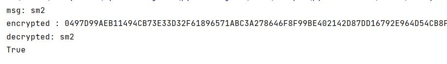

# sm2

文件依赖于gmssl 使用命令`pip install gmssl`安装

算法实现参考https://blog.csdn.net/qq_33439662/article/details/122590298

国家密码管理局sm2标准 https://www.oscca.gov.cn/sca/xxgk/2010-12/17/1002386/files/b791a9f908bb4803875ab6aeeb7b4e03.pdf

使用的密钥为：

```
p = 0xFFFFFFFEFFFFFFFFFFFFFFFFFFFFFFFFFFFFFFFF00000000FFFFFFFFFFFFFFFF
a = 0xFFFFFFFEFFFFFFFFFFFFFFFFFFFFFFFFFFFFFFFF00000000FFFFFFFFFFFFFFFC
b = 0x28E9FA9E9D9F5E344D5A9E4BCF6509A7F39789F515AB8F92DDBCBD414D940E93
n = 0xFFFFFFFEFFFFFFFFFFFFFFFFFFFFFFFF7203DF6B21C6052B53BBF40939D54123
Gx = 0x32C4AE2C1F1981195F9904466A39C9948FE30BBFF2660BE1715A4589334C74C7
Gy = 0xBC3736A2F4F6779C59BDCEE36B692153D0A9877CC62A474002DF32E52139F0A0
```

该参数为国家密码管理局推荐参数 https://www.oscca.gov.cn/sca/xxgk/2010-12/17/1002386/files/b965ce832cc34bc191cb1cde446b860d.pdf





