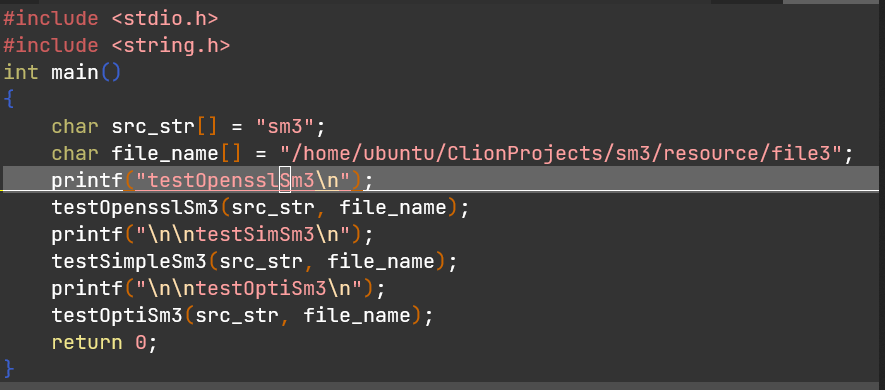

# sm3

| 运行平台 | ubuntu 20.04                                  |
| -------- | --------------------------------------------- |
| CPU      | Intel(R) Xeon(R) Platinum 8255C CPU @ 2.50GHz |
| 依赖     | cmake3.16                                     |

## 使用说明：

如下图：使用时请修改file_name的值，以指定一个有效的文件路径，然后运行文件夹中的脚本cr.sh即可`./cr.sh`



## 优化方法：

1. 预计算Tj<<j，这个量在每轮压缩的过程中都是可以预测的，可以将其提前计算出来，减小每次运行的移位计算开销

   ```c
   static uint32_t Tj[] = {
       0x79cc4519U, 0xf3988a32U, 0xe7311465U, 0xce6228cbU, 0x9cc45197U, 0x3988a32fU, 0x7311465eU, 0xe6228cbcU, 0xcc451979U, 0x988a32f3U, 0x311465e7U, 0x6228cbceU, 0xc451979cU, 0x88a32f39U, 0x11465e73U, 0x228cbce6U, 0x9d8a7a87U, 0x3b14f50fU, 0x7629ea1eU, 0xec53d43cU, 0xd8a7a879U, 0xb14f50f3U, 0x629ea1e7U, 0xc53d43ceU, 0x8a7a879dU, 0x14f50f3bU, 0x29ea1e76U, 0x53d43cecU, 0xa7a879d8U, 0x4f50f3b1U, 0x9ea1e762U, 0x3d43cec5U, 0x7a879d8aU, 0xf50f3b14U, 0xea1e7629U, 0xd43cec53U, 0xa879d8a7U, 0x50f3b14fU, 0xa1e7629eU, 0x43cec53dU, 0x879d8a7aU, 0x0f3b14f5U, 0x1e7629eaU, 0x3cec53d4U, 0x79d8a7a8U, 0xf3b14f50U, 0xe7629ea1U, 0xcec53d43U, 0x9d8a7a87U, 0x3b14f50fU, 0x7629ea1eU, 0xec53d43cU, 0xd8a7a879U, 0xb14f50f3U, 0x629ea1e7U, 0xc53d43ceU, 0x8a7a879dU, 0x14f50f3bU, 0x29ea1e76U, 0x53d43cecU, 0xa7a879d8U, 0x4f50f3b1U, 0x9ea1e762U, 0x3d43cec5U
   };
   ```

2. 并行进行消息扩展：

   使用avx256指令集进行并行，并行的思路为将8个消息都依次按字分组后，每个消息相同位置的字都放到同一个avx256寄存器中，之后按照相同的方法进行消息扩展：

   ```c
   #define loadw(x) _mm256_set_epi32(((uint32_t*)(msg[7]))[x], ((uint32_t*)(msg[6]))[x], ((uint32_t*)(msg[5]))[x], ((uint32_t*)(msg[4]))[x], ((uint32_t*)(msg[3]))[x], ((uint32_t*)(msg[2]))[x], ((uint32_t*)(msg[1]))[x], ((uint32_t*)(msg[0]))[x])
   
   __m256i W[68], W1[64];
       __m256i temp;
       __m256i shuffle_v = _mm256_set_epi8(12, 13, 14, 15, 8, 9, 10, 11, 4, 5, 6, 7, 0, 1, 2, 3, 12, 13, 14, 15, 8, 9, 10, 11, 4, 5, 6, 7, 0, 1, 2, 3);
       for (int i = 0; i < 16; i++) {
           W[i] = loadw(i);
           W[i] = _mm256_shuffle_epi8(W[i], shuffle_v);
       }
       for (int i = 16; i < 68; i++) {
           temp = _mm256_xor_si256(W[i - 16], W[i - 9]);
           temp = _mm256_xor_si256(temp, rol_256_epi32(W[i - 3], 15));
           temp = P1_256_epi32(temp);
           temp = _mm256_xor_si256(temp, rol_256_epi32(W[i - 13], 7));
           W[i] = _mm256_xor_si256(temp, W[i - 6]);
       }
       for (int i = 0; i < 64; i++) {
           W1[i] = _mm256_xor_si256(W[i], W[i + 4]);
       }
   ```

3. 循环展开：

   使用宏省去不必要的中间变量赋值以及循环跳转开销：

   ```c
   #define R(A, B, C, D, E, F, G, H, x)                             \
       SS1 = rol((rol(A, 12) + E + Tj[j]), 7);                      \
       SS2 = SS1 ^ rol(A, 12);                                      \
       TT1 = FF##x(A, B, C) + D + SS2 + (((uint32_t*)(W1 + j)))[i]; \
       TT2 = GG##x(E, F, G) + H + SS1 + (((uint32_t*)(W + j)))[i];  \
       B = rol(B, 9);                                               \
       H = TT1;                                                     \
       F = rol(F, 19);                                              \
       D = P0(TT2);                                                 \
       j++
   
   #define R8(A, B, C, D, E, F, G, H, x) \
       R(A, B, C, D, E, F, G, H, x);     \
       R(H, A, B, C, D, E, F, G, x);     \
       R(G, H, A, B, C, D, E, F, x);     \
       R(F, G, H, A, B, C, D, E, x);     \
       R(E, F, G, H, A, B, C, D, x);     \
       R(D, E, F, G, H, A, B, C, x);     \
       R(C, D, E, F, G, H, A, B, x);     \
       R(B, C, D, E, F, G, H, A, x)
   ```

   

## 结果说明：

本实验一共有三种实现，一是对openssl 的sm3进行测试，二是参考课堂用PPT进行简单的sm3实现，三是使用simd指令集以及循环展开，预计算对sm3优化。测试使用了128MiB的文件进行hash，优化后时间减小到标准openssl库的80%。


## 参考文献：

1. 课堂PPT

2. [guanzhi/GmSSL: 支持国密SM2/SM3/SM4/SM9/SSL的密码工具箱 (github.com)](https://github.com/guanzhi/GmSSL)